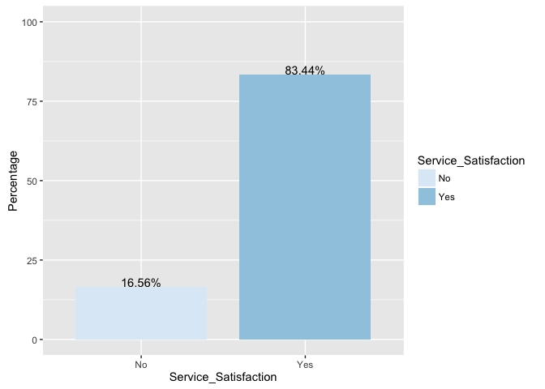
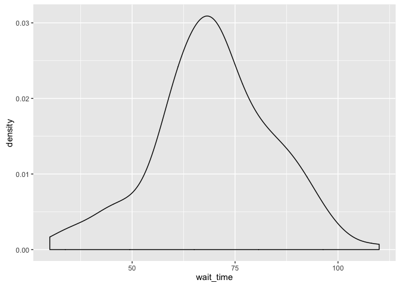
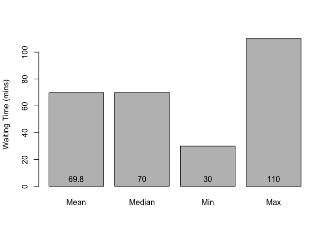
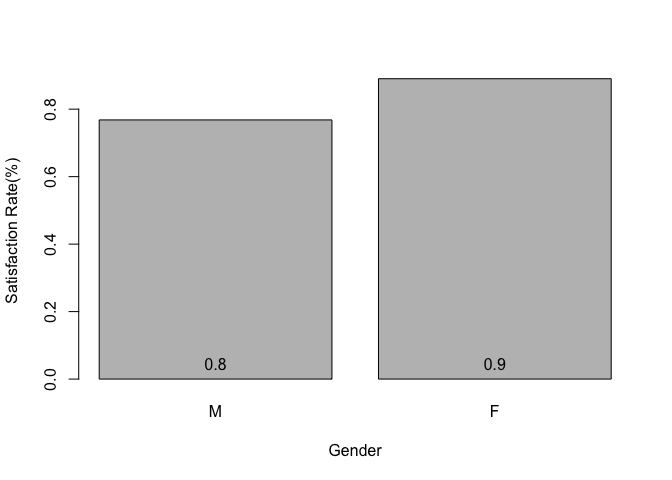
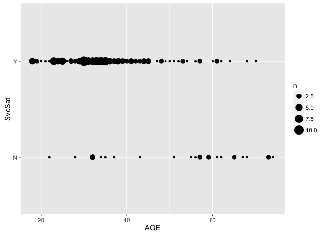

<h1>
Q1: Statistical index and chart for service satisfaction and waiting
time
</h1>
<h3>
1.  Service Satisfaction
    </h3>

  

<h3>
1.  Waiting Time
    </h3>

  
<h1>
Q2: Are there any differences in service satisfaction for age and
gender?
</h1>
<h3>
1.  Differences in satisfaction for gender
    </h3>
      

<h3>
1.  Differences in satisfaction for age
    </h3>
    
